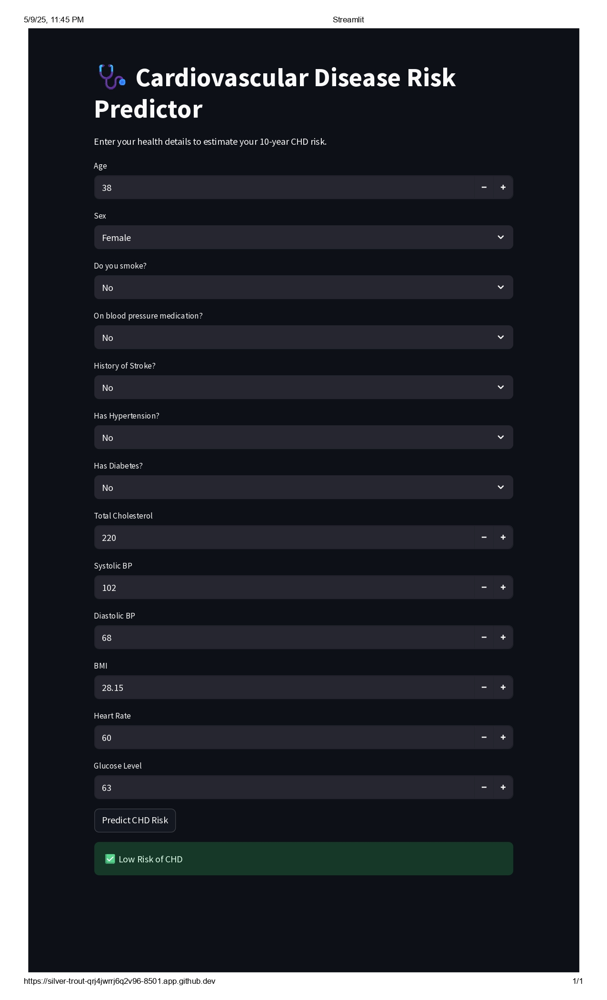

# 🩺 Cardiovascular Disease Risk Predictor

This is a Streamlit web application that predicts a user's **10-year risk of Coronary Heart Disease (CHD)** using machine learning — specifically an **XGBoost** model trained on a real-world cardiovascular dataset.

<<<<<<< HEAD
## 🚀 Live Demo
🔗 https://silver-trout-qrj4jwrrj6q2v96-8501.app.github.dev/

=======
>>>>>>> b3690bc99484a0faabc7d1c906606bf3e988c03f
## 💡 Features
- User-friendly web interface built with **Streamlit**
- Input parameters like age, sex, cholesterol, BP, smoking habits, etc.
- Model output: CHD risk prediction (Low / High) with confidence score
- Powered by **XGBoost**, one of the most powerful ML algorithms
- Real-time inference based on medical risk factors

## 🧠 Machine Learning
- Model: XGBoost Classifier
- Preprocessing: StandardScaler normalisation + one-hot encoding
- Trained on the dataset provided by the IEEE FLEPS Wearable Health Hackathon 2025
- Evaluation: Confusion matrix, classification report, and feature importance

## 🛠️ Tech Stack
- 🐍 Python
- 📊 Scikit-learn, Pandas, NumPy, XGBoost
- 🌐 Streamlit for UI
- 🗃️ Joblib for model persistence

## 📁 Project Structure
```
├── app.py # Streamlit app
├── xgb_model.joblib # Trained XGBoost model
├── scaler.joblib # Preprocessing scaler
├── feature_names.joblib # Required feature columns
├── requirements.txt # Python packages
└── README.md # Project description
```

## ⚙️ Setup Instructions

### 1. Clone the repository
```bash

git clone https://github.com/nimalan-parameshwaran/Cardiovascular-Disease-Risk-Predictor.git
cd Cardiovascular-Disease-Risk-Predictor
```
### 2. Install dependencies
```bash

pip install -r requirements.txt

```
### 3. Run Streamlit locally
```bash

streamlit run app.py

```
#### 4. Open your browser and go to `http://localhost:8501`

### 5. Input your health parameters and get your CHD risk prediction!


### 📄 Download PDF Report
You can download the detailed project documentation as a PDF [here]().
